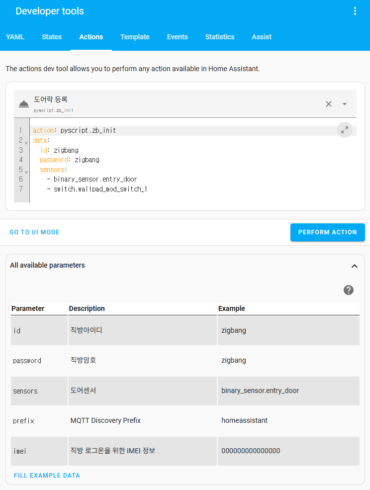
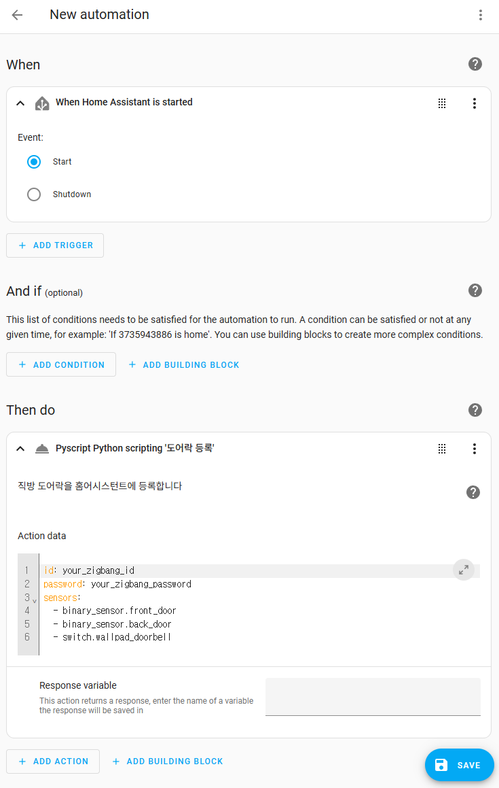
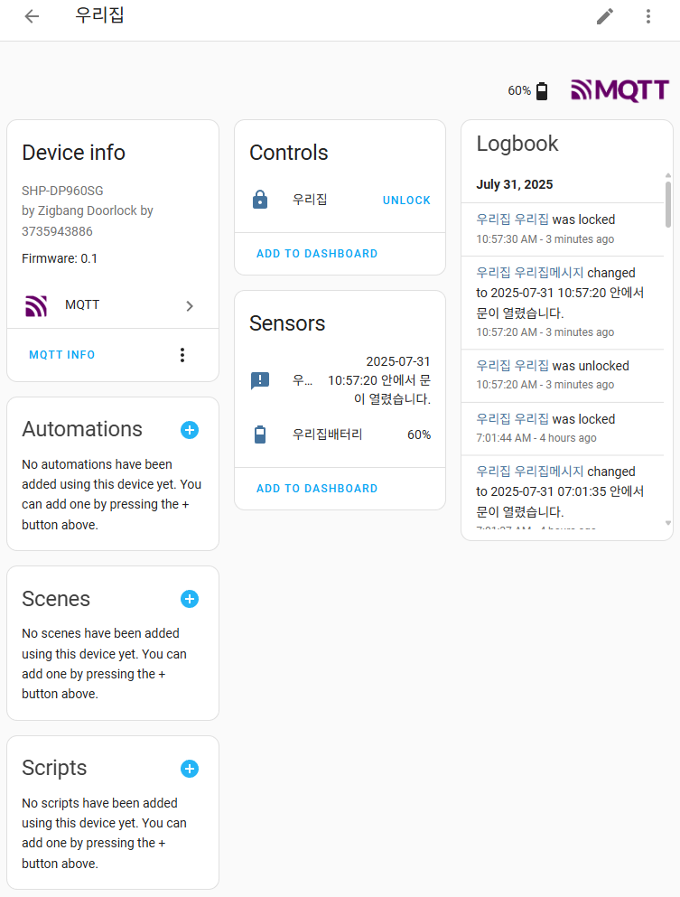

-----

## Zigbang Doorlock for Home Assistant

직방 도어락을 **Home Assistant**에 연동하기 위한 **Pyscript** 코드입니다. 이 코드를 사용하면 Home Assistant에서 도어락의 상태를 확인하고, 잠금을 해제할 수 있습니다.

-----

### 주요 기능

  - MQTT Discovery를 통해 Home Assistant에 자동으로 장치 등록
  - 도어락 잠금 해제
  - 도어락 잠금 상태 확인
  - 도어락 배터리 상태 확인
  - 도어락 이벤트 메시지 확인

-----

### 설치 방법

#### 1\. 필수 구성 요소 설치

  - **Home Assistant**: 이 코드는 Home Assistant 환경에서 동작합니다.
  - **Pyscript**: `Pyscript` 통합 구성요소를 설치하고 설정해야 합니다. 자세한 내용은 [Pyscript](https://hacs-pyscript.readthedocs.io/en/latest/installation.html)를 참고하세요.
  - **MQTT**: Home Assistant에 연동된 MQTT 브로커가 필요합니다. 자세한 내용은 [MQTT](https://www.home-assistant.io/integrations/mqtt/)를 참고하세요.

#### 2\. 코드 다운로드

`zigbang_doorlock.py`를 Home Assistant `<config>/pyscript` 폴더에 저장합니다.

#### 3\. Home Assistant에서 액션 호출

먼저 **개발자 도구 \> 액션** 메뉴에서 `pyscript.zb_init`를 호출하여 도어락을 수동으로 등록하고, 정상 동작하는지 확인합니다.



  - **액션**: `pyscript.zb_init`
  - **필수 매개변수**:
      - `id`: 직방 ID
      - `password`: 직방 비밀번호
  - **선택적 매개변수**:
      - `sensors`: 도어락의 상태를 확인 할 트리거 엔티티를 등록합니다.
          - 아무것도 등록하지 않으면 도어락 상태를 매 1분 간격으로 갱신합니다. 따라서 가능하면 최소 도어 센서 1개 등록은 권장합니다. 그 외 월패드 문 열림 스위치 등을 등록해 두면 좋습니다.
          - 여러 개의 엔티티를 지정하면 등록 된 엔티티 중 하나만 상태가 바뀌어도 도어락 상태를 갱신합니다.
      - `prefix`: MQTT Discovery에 사용될 접두사. 기본값은 `homeassistant`입니다. 생략가능.
      - `imei`: 직방 로그온을 위한 IMEI 정보. 자동으로 생성하므로 특별한 이유가 없다면 비워두셔도 됩니다.

액션 호출이 성공적으로 완료되면, Home Assistant에 새로운 `lock` 엔티티와 `sensor` 엔티티가 포함된 도어락 디바이스가 자동으로 생성됩니다.

-----

### 자동화 예시

정상적으로 동작하는 것을 확인했으면, Home Assistant가 시작될 때마다 이 액션을 자동으로 호출하도록 **자동화**를 만듭니다.



-----

### 사용 방법

등록 된 엔티티들을 필요에 따라 사용 합니다.



-----

### 로그북 오염 개선

Pyscript의 특성상 메소드가 호출될 때마다 로그북에 기록되기 때문에, 실제로 동작이 없는 주기성 트리거까지 모두 로그에 남아 불필요한 오염이 발생합니다.
중요한 이벤트는 로그북이 아닌 시스템 로그에 기록되므로, 로그북에서는 `pyscript` 도메인 전체를 제외하거나 특정 엔티티(예: 직방 도어락)만 제외하는 방식으로 관리할 수 있습니다.

```yaml
# 예시: pyscript 도메인 전체를 로그북에서 제외
recorder:
  exclude:
    domains:
      - pyscript
```
